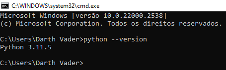

# Stake Double

## Instalação de Requisitos

Os passos a seguir foram executados numa máquina virtual zerada. Repetindo-os num sistema operacional como o Windows 10 ou Windows 11 garantem a funcionalidade da aplicação final. Acompanhe:

### Google Chrome

Instale o Google Chrome caso não o tenha instalado. Verifique se está usando a versão mais recente.

### Python

Instale o Python por este [link](https://www.python.org/downloads/) (versão mais recente).

Prossiga com a instalação padrão, mas atente-se em selecionar "Add python.exe to PATH".

Para testar a instalação:
* Aperte `Windows` + `r`;
* Digite `cmd`;
* Execute `python --version`.

Você deve obter algo como:

